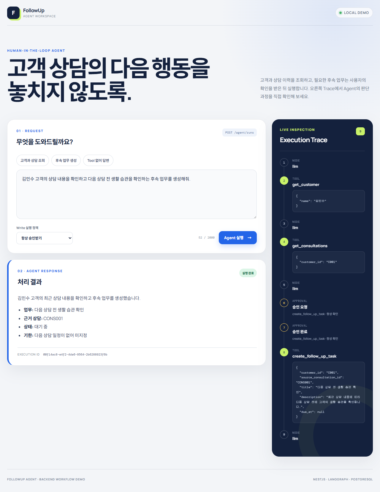

# FollowUp Agent

자연어 업무 요청을 기반으로 필요한 정보를 조회하고,
내부 정책을 참고해 판단을 보조하며,
사용자의 요청에 따라 후속 업무까지 실행하는 AI Agent 프로젝트입니다.

## 개발 상태

OpenAI Tool Calling과 LangGraph Workflow 기술 검증을 완료하고,
LangGraph를 MVP의 Agent Workflow Orchestration Layer로 채택했습니다.

NestJS 기반 Agent Backend MVP의 10단계 구현과 핵심 시나리오 E2E 검증을 완료했습니다.
`experiments`는 기술 검증 코드이며, 실제 MVP Backend는 `apps/api`, Web Demo는
`apps/web`에 구성합니다.

NestJS 개발 환경과 Backend 실행 기반을 구성했으며,
Customer, Consultation, FollowUpTask 도메인과 PostgreSQL 스키마 설계를 완료했습니다.
설계한 스키마를 TypeORM Migration으로 적용하고 C001 테스트 데이터를 구성했습니다.
Agent 동기 API의 요청, 응답, 오류와 실행 Trace 계약을 정의했습니다.
Tool 정의, 입력 검증, Handler 실행을 연결하는 공통 Registry를 구현했습니다.
고객 정보와 상담 이력 Read Tool이 실제 PostgreSQL Seed 데이터를 조회합니다.
LangGraph Workflow와 Agent HTTP API를 연결해 실제 LLM이 Read Tool을 선택하고
그 결과를 다음 판단에 사용하는 반복 실행 흐름을 구현했습니다.
후속 업무 Write Tool과 DB 멱등성 처리를 구현했으며,
Write Tool 실행 전 사용자 승인을 요청하거나 서버가 허용한 `auto` 정책으로
즉시 실행하는 LangGraph 중단·재개 Workflow를 연결했습니다.
Scripted LLM과 실제 PostgreSQL을 사용한 E2E에서 Tool 미사용, 다단계 Read,
승인 Write, 거절, 미존재 고객과 중복 승인 시나리오를 검증했습니다.
React Web Demo에서 자연어 요청, Markdown 답변, 실행 Trace와 Write Tool
승인·거절 흐름을 브라우저로 확인할 수 있습니다.



## 프로젝트 목표

- 자연어 요청에 따라 필요한 Tool을 선택하고 실행
- 여러 Tool을 순차적으로 사용하는 업무 Workflow 구성
- 내부 정책 문서를 활용한 RAG 기반 정보 검색
- 고객 데이터와 정책을 종합한 판단 근거 제공
- 사용자 승인 기반의 Write 작업 실행
- Agent 실행 실패 및 중복 실행 상황에 대한 안정성 검증
- 기존 GateLM과 연동하여 Agent → Gateway → LLM Provider 흐름 구성

## 대표 시나리오

운영 담당자가 다음과 같이 요청합니다.

> 최근 상담 이후 후속 관리가 필요한 고객을 찾아서 필요한 조치와 이유를 알려줘.

Agent는 고객 정보와 상담 이력을 조회하고,
관련 운영 정책을 검색하여 후속 관리가 필요한 후보와 근거를 제시합니다.

사용자가 후속 업무 생성을 요청하면 실제 업무를 생성하고 결과를 반환합니다.

## 저장소 구조

```text
FollowUp-Agent
├─ apps/
│  ├─ api/                       # 실제 NestJS Agent Backend
│  └─ web/                       # React Agent Web Demo
├─ experiments/
│  ├─ tool-calling/              # OpenAI Tool Calling 기술 검증
│  └─ langgraph/                 # LangGraph Workflow 기술 검증
├─ docs/
│  ├─ domain-model.md            # 도메인 관계와 PostgreSQL 스키마 설계
│  └─ technical-decisions/       # 기술 검증 결과와 결정 기록
├─ render.yaml                   # Render 공개 데모 Blueprint
├─ package.json
└─ pnpm-workspace.yaml
```

## 개발 환경

현재 검증한 환경은 다음과 같습니다.

- Node.js 22.23.1
- pnpm 9.15.0

현재 Backend는 시작할 때 PostgreSQL 연결을 초기화하므로 API 실행에는 PostgreSQL이 필요합니다.
단위 테스트와 외부 의존성을 대체한 E2E 테스트는 Docker 없이 실행할 수 있습니다.

## 설치

저장소 루트에서 의존성을 설치합니다.

```powershell
pnpm install
```

pnpm Workspace가 루트 기술 검증 패키지와 `apps/api`, `apps/web`의 의존성을 함께 설치합니다.

## 환경변수

예제 파일을 복사하여 API 전용 `.env`를 준비합니다.

```powershell
Copy-Item apps/api/.env.example apps/api/.env
```

| 이름 | 필수 | 기본값 | 역할 |
|---|---|---|---|
| `NODE_ENV` | 아니요 | `development` | 실행 환경 (`development`, `test`, `production`) |
| `PORT` | 아니요 | `3000` | API가 사용할 포트 |
| `DATABASE_URL` | 예 | 없음 | PostgreSQL 연결에 사용할 URL |
| `CORS_ORIGIN` | 아니요 | 없음 | 브라우저 접근을 허용할 Web Origin |
| `OPENAI_API_KEY` | 예 | 없음 | OpenAI Responses API 인증 키 |
| `OPENAI_MODEL` | 아니요 | `gpt-5.6` | Agent가 사용할 OpenAI 모델 |
| `AGENT_ALLOW_AUTO_WRITE` | 아니요 | `false` | 요청자가 선택한 `auto` Write 실행을 서버가 허용할지 여부 |

현재 `DATABASE_URL`은 PostgreSQL URL 형식만 검증합니다.
Migration과 Seed 스크립트가 이 URL을 사용해 PostgreSQL에 연결합니다.

`.env`에는 비밀번호나 API Key가 포함될 수 있으므로 Git에 커밋하지 않습니다.
`.env.example`에는 로컬 개발용 예시값만 기록합니다.

## PostgreSQL Migration 및 Seed

Docker Desktop을 실행한 뒤 PostgreSQL 컨테이너를 시작합니다.

```powershell
pnpm db:up
```

`compose.yaml`은 PostgreSQL 18.3 이미지를 사용하며 Health Check가 통과할 때까지 기다립니다.

빈 데이터베이스에 아직 적용되지 않은 Migration을 실행합니다.

```powershell
pnpm db:migrate
pnpm db:migration:show
```

C001 김민수 고객과 상담 이력 2건을 구성하고 결과를 확인합니다.

```powershell
pnpm db:seed
pnpm db:verify
```

Seed는 `customer_code`와 `consultation_code`를 기준으로 Upsert하므로 반복 실행해도
C001 고객과 정의된 상담 이력이 중복 생성되지 않습니다.

가장 최근 Migration을 롤백하려면 다음 명령을 사용합니다.

```powershell
pnpm db:revert
```

롤백은 스키마와 저장 데이터를 제거할 수 있으므로 로컬 검증 DB에서만 사용합니다.
컨테이너를 중지하고 제거하되 데이터 볼륨을 유지하려면 다음 명령을 사용합니다.

```powershell
pnpm db:down
```

## Backend 실행

개발 모드로 실행합니다.

```powershell
pnpm api:start:dev
```

일반 실행은 다음 명령을 사용합니다.

```powershell
pnpm api:start
```

빌드된 JavaScript를 실행하려면 다음 명령을 사용합니다.

```powershell
pnpm api:build
pnpm --filter @followup-agent/api start:prod
```

`start:prod`는 빌드 결과를 실행하는 명령이며,
프로덕션 배포나 운영 인프라 구성이 완료됐다는 의미는 아닙니다.

## Web Demo 실행

API와 PostgreSQL을 먼저 실행한 뒤 새 PowerShell에서 Web 개발 서버를 시작합니다.

```powershell
pnpm web:dev
```

브라우저에서 `http://localhost:5173`을 엽니다. 개발 서버는 `/api` 요청을
`http://localhost:3000`으로 Proxy하므로 로컬에서는 별도 Web 환경변수가 필요하지 않습니다.

API를 다른 주소에서 실행한다면 `apps/web/.env.example`을 복사하고
`VITE_API_BASE_URL`에 해당 API 주소를 설정합니다. API도 Web Origin을
`CORS_ORIGIN`으로 허용해야 합니다.

Web Demo에서 다음 기능을 확인할 수 있습니다.

- Tool 미사용, 고객·상담 조회와 후속 업무 생성 예시 요청
- Node, Tool arguments와 승인 결정을 보여주는 실행 Trace
- `required`와 서버 허용 기반 `auto` Write 실행 정책 선택
- Write Tool arguments 확인 후 승인 또는 거절
- Markdown 최종 답변과 실행 ID 표시

## Health API

Backend 실행 후 다음 요청으로 프로세스 상태를 확인합니다.

```powershell
Invoke-RestMethod http://localhost:3000/health
```

예상 응답은 다음과 같습니다.

```json
{
  "status": "ok"
}
```

현재 Health API는 NestJS 프로세스가 HTTP 요청을 처리할 수 있는지만 확인합니다.
PostgreSQL, OpenAI, LangGraph와 같은 외부 의존성의 준비 상태는 확인하지 않습니다.

## 공개 데모 배포

`render.yaml`은 React Static Site, NestJS Web Service, PostgreSQL을 무료 Render
리소스로 구성합니다. API 시작 시 빌드된 Migration과 멱등 Seed를 적용하며,
`OPENAI_API_KEY`는 Dashboard Secret으로만 입력합니다.

공개 Agent 실행은 동일 IP 기준 분당 5회로 제한하고,
`AGENT_ALLOW_AUTO_WRITE=false`를 유지해 Write Tool은 사용자 승인 후에만 실행합니다.
배포 절차와 무료 플랜 제약은 [공개 데모 배포 문서](./docs/deployment.md)에 정리했습니다.

- [공개 Web Demo](https://followup-agent-web.onrender.com)
- [API Health](https://followup-agent-api.onrender.com/health)

2026-09-01~02 KST에 공개 환경에서 Health, 고객·상담 조회, Tool 없는 인사,
Write 승인 대기와 거절 경로를 확인했습니다. 무료 API 인스턴스가 중지된 뒤 첫 요청은
기동에 시간이 걸릴 수 있습니다.

## Agent API

Agent 실행은 동기식 `POST /agent/runs` 요청으로 시작합니다.

```powershell
Invoke-RestMethod `
  -Method Post `
  -Uri http://localhost:3000/agent/runs `
  -ContentType 'application/json' `
  -Body '{"message":"김민수 고객의 기본 정보와 최근 상담 내용을 같이 알려줘."}'
```

응답에는 실행 식별자, 최종 답변과 실제 Node/Tool 실행 순서를 담은 `trace`가 포함됩니다.
LLM이 Function Call을 반환하면 공통 Tool Registry가 해당 Tool을 실행하고,
그 결과를 다시 LLM에 전달합니다. Function Call이 없을 때 Workflow가 종료됩니다.

Write Tool 요청의 기본 정책은 `required`입니다. 최초 응답이
`awaiting_approval`이면 같은 `executionId`로 승인 또는 거절합니다.

```powershell
Invoke-RestMethod `
  -Method Post `
  -Uri http://localhost:3000/agent/runs/{executionId}/approval `
  -ContentType 'application/json' `
  -Body '{"decision":"approve"}'
```

요청자가 `writeApprovalMode: "auto"`를 선택해도
`AGENT_ALLOW_AUTO_WRITE=true`인 서버에서만 즉시 실행됩니다.
서버가 허용하지 않으면 실제 적용 모드는 `required`로 낮아집니다.

## 품질 검증

| 명령 | 역할 |
|---|---|
| `pnpm api:lint` | API와 테스트 코드의 ESLint 검사 |
| `pnpm api:build` | TypeScript strict 검사 및 NestJS build |
| `pnpm web:lint` | Web TypeScript와 React ESLint 검사 |
| `pnpm web:build` | Web TypeScript 검사 및 Vite production build |
| `pnpm web:test` | API Client, 답변, 승인과 오류 UI 단위 테스트 |
| `pnpm test` | 환경변수, Tool Registry와 Agent Workflow 단위 테스트 |
| `pnpm test:e2e` | 외부 의존성을 대체한 Health/Agent API E2E 테스트 |
| `pnpm test:integration` | 실제 PostgreSQL을 사용하는 Tool, 승인 Workflow와 핵심 API E2E 테스트 |
| `pnpm agent:verify` | 실제 PostgreSQL과 OpenAI를 사용하는 Agent Workflow 검증 |

전체 검증은 다음 순서로 실행합니다.

```powershell
pnpm api:lint
pnpm api:build
pnpm web:lint
pnpm web:build
pnpm web:test
pnpm test
pnpm test:e2e
pnpm test:integration
```

`pnpm test:integration`을 실행하기 전에 `pnpm db:up`, `pnpm db:migrate`,
`pnpm db:seed`로 테스트 데이터베이스를 준비해야 합니다.

`pnpm agent:verify`는 일반 테스트와 달리 실제 OpenAI API를 호출하므로
`OPENAI_API_KEY`, `OPENAI_MODEL`, `DATABASE_URL`이 설정된 환경에서 필요할 때만 실행합니다.
인사, 단일 Tool, 다단계 Tool 경로와 `C001` 인자 전달을 검증합니다.

## 현재 적용된 Backend 기본 설정

- TypeScript strict
- ESLint
- 환경변수 Fail-fast 검증
- Helmet 기반 보안 HTTP Header
- 환경변수 기반 CORS 정책
- 전역 ValidationPipe
- Shutdown Hook
- Health API
- Jest 단위 테스트
- Supertest E2E 테스트

이는 향후 API 구현을 위한 최소 보안·운영 기반이며,
인증·인가와 운영 보안 구성이 완료됐다는 의미는 아닙니다.

## 기술 검증 실행

LangGraph의 State 전달과 조건 분기 실험은 다음 명령으로 실행할 수 있습니다.

```powershell
pnpm tsx experiments/langgraph/basic-graph.ts
```

실제 OpenAI Tool Calling 실험은 루트 `.env`의 `OPENAI_API_KEY`가 필요합니다.

```powershell
pnpm tsx experiments/tool-calling/index.ts
```

## 현재 제한 사항

- 인증·인가 미구현
- 공개 Agent 실행에 단일 인스턴스 메모리 기반 분당 5회 제한만 적용
- Health API는 DB readiness를 확인하지 않음
- Tool 실패 재시도, timeout과 오류 응답 매핑 미구현
- 승인 checkpoint는 프로세스 메모리에 저장되므로 서버 재시작과 다중 인스턴스를 지원하지 않음
- `auto` 허용은 서버 전역 설정이며 사용자별 권한 체계는 아직 미구현
- Web은 현재 실행 한 건만 표시하며 대화 Thread와 Streaming을 지원하지 않음
- Render 자동 배포 연결은 미검증이며, 이번 배포는 Dashboard의 수동 동기화·배포로 수행

현재 Agent Backend MVP와 이를 직접 조작하는 최소 Web Demo를 완료했고,
Render Web/API/PostgreSQL 배포와 공개 URL 핵심 시나리오를 검증했습니다.
현재는 확인된 버그를 수정하며 안정화하는 단계이고, RAG와 GateLM 연동은 후속 확장 범위입니다.

## 문서

- [Project Brief](./docs/00-project-brief.md)
- [도메인 모델 및 PostgreSQL 스키마 설계](./docs/domain-model.md)
- [Agent API 요청·응답 계약](./docs/api-contract.md)
- [Tool 인터페이스 및 실행 구조](./docs/tool-execution.md)
- [후속 업무 Write Tool](./docs/write-tool.md)
- [핵심 Agent 시나리오 E2E 검증](./docs/e2e-scenarios.md)
- [Agent Web Demo 구조 및 검증](./docs/web-demo.md)
- [공개 데모 배포](./docs/deployment.md)
- [Tool Calling 기술 결정](./docs/technical-decisions/tool-calling.md)
- [LangGraph 기술 결정](./docs/technical-decisions/langgraph.md)
