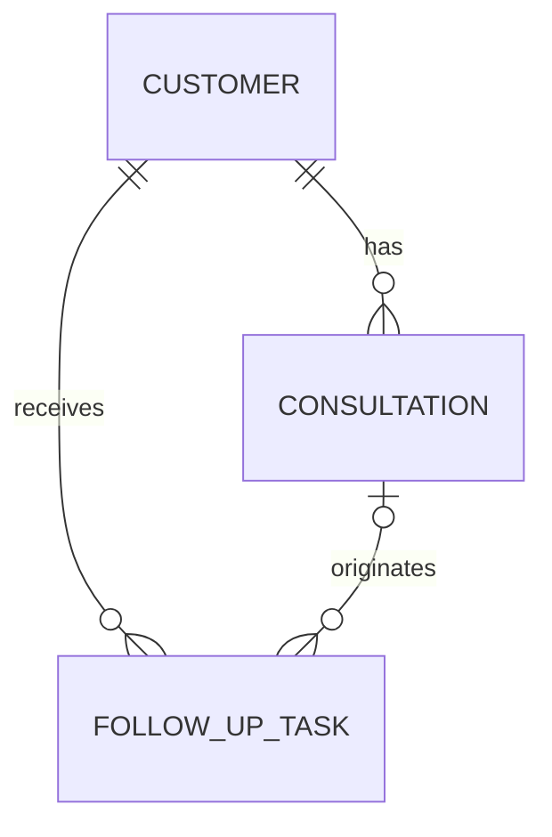

# FollowUp Agent 도메인 모델 및 PostgreSQL 스키마 설계

## 1. 문서 목적

이 문서는 AGENT-12 `도메인 모델 및 PostgreSQL 스키마 설계`의 설계 기준을 기록한다.

FollowUp Agent MVP가 고객 정보, 상담 이력, 후속 업무를 일관된 관계로 저장하고
이후 Read Tool과 Write Tool이 같은 도메인 의미를 사용하도록 하는 것이 목적이다.

이번 단계에서는 논리 모델과 PostgreSQL 스키마를 설계한다.
실제 Migration, Docker 기반 PostgreSQL, Seed 데이터와 ORM 도입은 다음 작업에서 진행한다.

## 2. 설계 범위와 원칙

- 실제 개인정보가 아닌 가상의 테스트 데이터만 사용한다.
- 데이터베이스 내부 식별자와 사용자에게 노출할 업무 식별자를 구분한다.
- 고객 이름은 동명이인이 존재할 수 있으므로 고유값으로 취급하지 않는다.
- 상담 이력과 후속 업무는 고객의 업무 기록이므로 고객과의 참조 무결성을 보장한다.
- 이력 보존을 위해 물리 삭제보다 상태 변경을 우선한다.
- 시간 값은 서버와 사용자의 시간대 차이를 고려해 절대 시점을 저장한다.
- 중복 실행 방지와 Agent 실행 추적에 필요한 확장 지점을 남긴다.

## 3. 도메인 책임

### Customer

고객의 최소 식별 정보와 현재 관리 상태를 나타내는 Aggregate Root다.

책임:

- 고객을 내부 식별자와 업무 식별자로 구분한다.
- 고객의 표시 이름과 활성 상태를 관리한다.
- 해당 고객의 상담 이력과 후속 업무를 조회하는 시작점이 된다.

MVP에서는 전화번호, 이메일, 주소와 같은 실제 개인정보를 저장하지 않는다.

### Consultation

특정 고객과 수행한 상담의 시점과 요약을 나타내는 이력 데이터다.

책임:

- 어떤 고객의 상담인지 연결한다.
- 상담 시점과 상담 요약을 보존한다.
- 고객별 최근 상담 이력을 시간 역순으로 조회할 수 있게 한다.
- 필요한 경우 후속 업무가 생성된 근거 상담이 된다.

이미 수행된 상담은 과거 사실이므로 상태 변경이나 물리 삭제 대상이 아니다.
내용 정정이 필요하면 별도 감사 정책을 도입하기 전까지 애플리케이션에서 제한한다.

### FollowUpTask

고객에게 수행해야 하는 후속 조치와 진행 상태를 나타내는 업무 데이터다.

책임:

- 업무 대상 고객을 연결한다.
- 후속 조치의 제목, 설명, 기한과 상태를 관리한다.
- 특정 상담에서 파생된 경우 근거 상담을 선택적으로 연결한다.
- 완료 상태와 완료 시점의 일관성을 유지한다.
- Write Tool 재시도 시 중복 생성을 방지할 수 있는 키를 수용한다.

## 4. 엔티티 관계



- 고객 한 명은 상담 이력을 0개 이상 가진다.
- 상담 이력 하나는 반드시 고객 한 명에게 속한다.
- 고객 한 명은 후속 업무를 0개 이상 가진다.
- 후속 업무 하나는 반드시 고객 한 명에게 속한다.
- 후속 업무는 특정 상담에서 파생될 수도 있고, 상담과 무관하게 생성될 수도 있다.
- 근거 상담이 연결된 후속 업무는 반드시 해당 업무와 같은 고객의 상담을 참조해야 한다.

## 5. 도메인 상태

### Customer 상태

| 상태 | 의미 | 허용되는 다음 상태 |
|---|---|---|
| `active` | 현재 후속 관리 대상이 될 수 있는 고객 | `inactive` |
| `inactive` | 현재 운영 대상에서 제외된 고객 | `active` |

`inactive`는 고객과 기존 업무 기록을 삭제하지 않고 운영 대상에서만 제외하기 위한 상태다.

### FollowUpTask 상태

| 상태 | 의미 | 허용되는 다음 상태 |
|---|---|---|
| `pending` | 생성됐지만 아직 시작하지 않은 업무 | `in_progress`, `cancelled` |
| `in_progress` | 담당자가 처리 중인 업무 | `completed`, `cancelled` |
| `completed` | 정상적으로 완료된 업무 | 없음 |
| `cancelled` | 더 이상 수행하지 않는 업무 | 없음 |

MVP에서는 종료된 업무를 다시 여는 전이를 지원하지 않는다.
필요해지면 상태 이력 모델과 함께 별도 작업으로 확장한다.

## 6. 핵심 불변 조건

- 모든 엔티티는 변경되지 않는 내부 식별자를 가진다.
- `customer_code`와 `consultation_code`는 각각 업무 식별자로 고유해야 한다.
- 고객 이름은 필수지만 고유하지 않다.
- 상담은 존재하는 고객만 참조할 수 있다.
- 후속 업무는 존재하는 고객만 참조할 수 있다.
- 후속 업무가 근거 상담을 참조하면 상담과 업무의 고객이 같아야 한다.
- `completed` 상태인 후속 업무만 완료 시각을 가진다.
- 제목, 이름, 상담 요약에는 공백만 저장할 수 없다.

## 7. PostgreSQL 테이블 설계

### `customers`

| 컬럼 | PostgreSQL 타입 | NULL | 기본값 | 제약조건과 의미 |
|---|---|---:|---|---|
| `id` | `uuid` | 불가 | `gen_random_uuid()` | PK, 변경되지 않는 내부 식별자 |
| `customer_code` | `varchar(20)` | 불가 | 없음 | 업무 식별자, UNIQUE, 공백 불가 |
| `name` | `varchar(100)` | 불가 | 없음 | 고객 표시 이름, 공백 불가, 중복 허용 |
| `status` | `varchar(20)` | 불가 | `'active'` | `active`, `inactive`만 허용 |
| `created_at` | `timestamptz` | 불가 | `now()` | 생성 시각 |
| `updated_at` | `timestamptz` | 불가 | `now()` | 마지막 변경 시각 |

### `consultations`

| 컬럼 | PostgreSQL 타입 | NULL | 기본값 | 제약조건과 의미 |
|---|---|---:|---|---|
| `id` | `uuid` | 불가 | `gen_random_uuid()` | PK, 변경되지 않는 내부 식별자 |
| `consultation_code` | `varchar(20)` | 불가 | 없음 | 업무 식별자, UNIQUE, 공백 불가 |
| `customer_id` | `uuid` | 불가 | 없음 | `customers.id` FK |
| `consulted_at` | `timestamptz` | 불가 | 없음 | 실제 상담 시각 |
| `summary` | `text` | 불가 | 없음 | 상담 내용 요약, 공백 불가 |
| `created_at` | `timestamptz` | 불가 | `now()` | 레코드 생성 시각 |
| `updated_at` | `timestamptz` | 불가 | `now()` | 마지막 변경 시각 |

`(id, customer_id)` 조합에는 UNIQUE 제약조건을 추가한다.
이는 후속 업무가 근거 상담을 연결할 때 상담과 업무의 고객이 같은지
복합 Foreign Key로 검증하기 위한 참조 키다.

### `follow_up_tasks`

| 컬럼 | PostgreSQL 타입 | NULL | 기본값 | 제약조건과 의미 |
|---|---|---:|---|---|
| `id` | `uuid` | 불가 | `gen_random_uuid()` | PK, 변경되지 않는 업무 식별자 |
| `customer_id` | `uuid` | 불가 | 없음 | 업무 대상인 `customers.id` FK |
| `source_consultation_id` | `uuid` | 허용 | `NULL` | 근거 상담이 있을 때 `consultations.id` 참조 |
| `title` | `varchar(200)` | 불가 | 없음 | 후속 업무 제목, 공백 불가 |
| `description` | `text` | 허용 | `NULL` | 수행할 조치와 생성 근거 |
| `status` | `varchar(20)` | 불가 | `'pending'` | `pending`, `in_progress`, `completed`, `cancelled`만 허용 |
| `due_at` | `timestamptz` | 허용 | `NULL` | 업무 기한이 있을 때의 절대 시각 |
| `completed_at` | `timestamptz` | 허용 | `NULL` | `completed` 상태일 때만 필수 |
| `idempotency_key` | `varchar(100)` | 허용 | `NULL` | Write Tool 재시도 중복 방지용 키 |
| `created_at` | `timestamptz` | 불가 | `now()` | 생성 시각 |
| `updated_at` | `timestamptz` | 불가 | `now()` | 마지막 변경 시각 |

`idempotency_key`는 Agent가 생성한 업무에만 사용한다.
수동 또는 Seed 업무는 `NULL`을 허용하며, 값이 있으면 전체 테이블에서 고유해야 한다.

## 8. 참조 DDL

다음 SQL은 AGENT-13 Migration 구현의 기준이 되는 설계 표현이다.
아직 실행 가능한 Migration 파일은 아니며, 실제 도구를 선택한 뒤 동일한 제약조건으로 변환한다.

```sql
CREATE TABLE customers (
    id uuid PRIMARY KEY DEFAULT gen_random_uuid(),
    customer_code varchar(20) NOT NULL,
    name varchar(100) NOT NULL,
    status varchar(20) NOT NULL DEFAULT 'active',
    created_at timestamptz NOT NULL DEFAULT now(),
    updated_at timestamptz NOT NULL DEFAULT now(),
    CONSTRAINT uq_customers_customer_code UNIQUE (customer_code),
    CONSTRAINT ck_customers_customer_code_not_blank
        CHECK (btrim(customer_code) <> ''),
    CONSTRAINT ck_customers_name_not_blank
        CHECK (btrim(name) <> ''),
    CONSTRAINT ck_customers_status
        CHECK (status IN ('active', 'inactive'))
);

CREATE TABLE consultations (
    id uuid PRIMARY KEY DEFAULT gen_random_uuid(),
    consultation_code varchar(20) NOT NULL,
    customer_id uuid NOT NULL,
    consulted_at timestamptz NOT NULL,
    summary text NOT NULL,
    created_at timestamptz NOT NULL DEFAULT now(),
    updated_at timestamptz NOT NULL DEFAULT now(),
    CONSTRAINT uq_consultations_consultation_code
        UNIQUE (consultation_code),
    CONSTRAINT uq_consultations_id_customer
        UNIQUE (id, customer_id),
    CONSTRAINT fk_consultations_customer
        FOREIGN KEY (customer_id)
        REFERENCES customers (id)
        ON DELETE RESTRICT,
    CONSTRAINT ck_consultations_code_not_blank
        CHECK (btrim(consultation_code) <> ''),
    CONSTRAINT ck_consultations_summary_not_blank
        CHECK (btrim(summary) <> '')
);

CREATE TABLE follow_up_tasks (
    id uuid PRIMARY KEY DEFAULT gen_random_uuid(),
    customer_id uuid NOT NULL,
    source_consultation_id uuid,
    title varchar(200) NOT NULL,
    description text,
    status varchar(20) NOT NULL DEFAULT 'pending',
    due_at timestamptz,
    completed_at timestamptz,
    idempotency_key varchar(100),
    created_at timestamptz NOT NULL DEFAULT now(),
    updated_at timestamptz NOT NULL DEFAULT now(),
    CONSTRAINT fk_follow_up_tasks_customer
        FOREIGN KEY (customer_id)
        REFERENCES customers (id)
        ON DELETE RESTRICT,
    CONSTRAINT fk_follow_up_tasks_source_consultation
        FOREIGN KEY (source_consultation_id, customer_id)
        REFERENCES consultations (id, customer_id)
        ON DELETE RESTRICT,
    CONSTRAINT ck_follow_up_tasks_title_not_blank
        CHECK (btrim(title) <> ''),
    CONSTRAINT ck_follow_up_tasks_status
        CHECK (status IN ('pending', 'in_progress', 'completed', 'cancelled')),
    CONSTRAINT ck_follow_up_tasks_completion
        CHECK (
            (status = 'completed' AND completed_at IS NOT NULL)
            OR (status <> 'completed' AND completed_at IS NULL)
        ),
    CONSTRAINT ck_follow_up_tasks_idempotency_key_not_blank
        CHECK (idempotency_key IS NULL OR btrim(idempotency_key) <> '')
);
```

## 9. 참조 및 삭제 정책

| 관계 | Foreign Key | 삭제 정책 | 이유 |
|---|---|---|---|
| 상담 → 고객 | `consultations.customer_id` | `RESTRICT` | 상담 이력이 남아 있으면 고객 기록 삭제 금지 |
| 후속 업무 → 고객 | `follow_up_tasks.customer_id` | `RESTRICT` | 업무 이력이 남아 있으면 고객 기록 삭제 금지 |
| 후속 업무 → 근거 상담 | `(source_consultation_id, customer_id)` | `RESTRICT` | 업무의 생성 근거가 된 상담 삭제 금지 |

MVP에서는 물리 삭제 API를 제공하지 않는다.
고객은 `inactive`, 후속 업무는 `cancelled` 상태를 사용해 운영 대상에서 제외한다.

`updated_at DEFAULT now()`는 생성 시각만 자동으로 채운다.
레코드 변경 시각은 이후 Repository 또는 ORM 계층에서 명시적으로 갱신해야 한다.

## 10. PostgreSQL 설계 근거

- PostgreSQL의 `uuid` 타입과 `gen_random_uuid()`를 내부 PK에 사용한다.
- 업무 발생 시각은 시간대가 다른 환경에서도 같은 절대 시점을 나타내도록 `timestamptz`로 저장한다.
- 필수값은 `NOT NULL`, 허용값은 `CHECK`, 고유 업무 식별자는 `UNIQUE`로 데이터베이스에서도 검증한다.
- 고객과 상담의 관계 및 같은 고객의 근거 상담 조건은 단일·복합 `FOREIGN KEY`로 검증한다.
- Foreign Key 선언만으로 참조하는 쪽 컬럼의 인덱스가 자동 생성되지는 않으므로 조회 인덱스는 별도로 정의한다.

참고한 PostgreSQL 공식 문서:

- [UUID Type](https://www.postgresql.org/docs/current/datatype-uuid.html)
- [UUID Functions](https://www.postgresql.org/docs/current/functions-uuid.html)
- [Date/Time Types](https://www.postgresql.org/docs/current/datatype-datetime.html)
- [Constraints](https://www.postgresql.org/docs/current/ddl-constraints.html)

## 11. 주요 조회 경로

### 고객 업무 코드 조회

`customer_code`는 사용자나 다른 Tool이 특정 고객을 확정한 뒤 사용하는 고유 업무 식별자다.

```sql
SELECT id, customer_code, name, status
FROM customers
WHERE customer_code = $1;
```

UNIQUE 제약조건이 만든 인덱스를 사용한다.

### 고객 이름 조회

`get_customer(name)`은 고객 이름을 검색하지만 이름 자체는 고유하지 않다.

```sql
SELECT id, customer_code, name, status
FROM customers
WHERE name = $1
  AND status = 'active'
ORDER BY customer_code;
```

조회 결과가 0건이면 미존재, 1건이면 고객 확정, 2건 이상이면 동명이인으로 처리한다.
동명이인 중 첫 행을 임의로 선택하지 않고 `customer_code`와 같은 추가 식별 정보를 요청한다.

### 고객별 최근 상담 이력 조회

```sql
SELECT id, consultation_code, customer_id, consulted_at, summary
FROM consultations
WHERE customer_id = $1
ORDER BY consulted_at DESC, id DESC
LIMIT $2;
```

동일한 상담 시각이 있더라도 `id`를 보조 정렬 키로 사용해 결과 순서를 안정적으로 유지한다.

### 최근 상담 고객 후보 조회

대표 시나리오에서 지정한 시점 이후의 상담과 활성 고객을 함께 조회한다.

```sql
SELECT
    c.id AS customer_id,
    c.customer_code,
    c.name,
    cs.id AS consultation_id,
    cs.consulted_at,
    cs.summary
FROM consultations AS cs
JOIN customers AS c ON c.id = cs.customer_id
WHERE c.status = 'active'
  AND cs.consulted_at >= $1
ORDER BY cs.consulted_at DESC, cs.id DESC;
```

이 조회는 후보 데이터를 가져올 뿐, 후속 관리 필요 여부를 DB가 임의로 판단하지 않는다.
Agent가 이후 정책 검색 결과와 함께 판단 근거를 구성한다.

### 고객별 미완료 후속 업무 조회

```sql
SELECT id, customer_id, title, status, due_at, created_at
FROM follow_up_tasks
WHERE customer_id = $1
  AND status IN ('pending', 'in_progress')
ORDER BY due_at ASC NULLS LAST, created_at DESC;
```

완료되거나 취소된 업무는 기본 업무 목록에서 제외하지만 별도 이력 조회로 접근할 수 있다.

### Write Tool 중복 실행 확인

```sql
SELECT id, customer_id, status
FROM follow_up_tasks
WHERE idempotency_key = $1;
```

Write Tool은 동일한 `idempotency_key`로 업무 생성을 재시도할 때
새 행을 만들지 않고 기존 결과를 반환해야 한다.

## 12. 인덱스 설계

```sql
CREATE INDEX idx_customers_name
    ON customers (name);

CREATE INDEX idx_consultations_customer_recent
    ON consultations (customer_id, consulted_at DESC, id DESC);

CREATE INDEX idx_consultations_recent
    ON consultations (consulted_at DESC, id DESC, customer_id);

CREATE INDEX idx_follow_up_tasks_customer_created
    ON follow_up_tasks (customer_id, created_at DESC);

CREATE INDEX idx_follow_up_tasks_open_by_customer
    ON follow_up_tasks (
        customer_id,
        due_at ASC NULLS LAST,
        created_at DESC
    )
    WHERE status IN ('pending', 'in_progress');

CREATE INDEX idx_follow_up_tasks_source_consultation
    ON follow_up_tasks (source_consultation_id, customer_id)
    WHERE source_consultation_id IS NOT NULL;

CREATE UNIQUE INDEX uq_follow_up_tasks_idempotency_key
    ON follow_up_tasks (idempotency_key)
    WHERE idempotency_key IS NOT NULL;
```

| 인덱스 | 지원하는 경로 |
|---|---|
| `idx_customers_name` | 이름 기반 고객 조회, 동명이인 확인 |
| `idx_consultations_customer_recent` | 고객별 최근 상담 이력 |
| `idx_consultations_recent` | 기간 기준 최근 상담 고객 후보 |
| `idx_follow_up_tasks_customer_created` | 고객별 전체 후속 업무 이력과 FK 참조 검사 |
| `idx_follow_up_tasks_open_by_customer` | 고객별 미완료 업무와 기한 순 정렬 |
| `idx_follow_up_tasks_source_consultation` | 근거 상담을 참조하는 업무 및 FK 참조 검사 |
| `uq_follow_up_tasks_idempotency_key` | Write Tool 재시도 중복 생성 방지 |

Primary Key와 UNIQUE 제약조건이 이미 생성하는 인덱스는 중복해서 정의하지 않는다.
데이터가 없는 설계 단계이므로 성능 향상을 주장하지 않으며,
AGENT-13에서 Seed 데이터를 구성한 뒤 `EXPLAIN (ANALYZE, BUFFERS)`로 실제 실행 계획을 확인한다.

## 13. 주요 설계 선택과 트레이드오프

### UUID PK와 업무 코드 분리

UUID는 애플리케이션 내부 관계에 사용하고 `C001`, `CONS001` 같은 코드는
테스트와 사용자 응답에서 식별하기 쉬운 업무 식별자로 사용한다.
업무 코드 형식은 바뀔 수 있지만 내부 관계의 PK는 영향을 받지 않는다.

### 고객 이름 중복 허용

실제 업무에서는 동명이인이 존재하므로 `name`에 UNIQUE를 적용하지 않는다.
이 때문에 이름 조회 Tool은 다건 결과를 명시적으로 처리해야 하지만,
잘못된 고객을 임의로 선택하는 위험을 줄일 수 있다.

### 상태를 `varchar`와 CHECK로 표현

PostgreSQL 전용 ENUM 대신 문자열 컬럼과 이름이 있는 CHECK 제약조건을 사용한다.
허용값은 DB에서 검증하면서도 이후 상태 추가 시 ENUM 타입 변경에 결합되지 않는다.
애플리케이션에서는 같은 값을 TypeScript 타입으로 중복 없이 관리해야 한다.

### `timestamptz` 사용

상담, 기한, 완료와 감사 시각은 모두 절대 시점이므로 `timestamptz`를 사용한다.
표시할 때 사용자 시간대로 변환하며 입력 시 사용한 원래 시간대 문자열은 별도로 보존하지 않는다.

### 물리 삭제 제한

상담과 후속 업무는 Agent 응답과 실행의 근거가 되는 업무 이력이다.
따라서 Cascade 삭제를 사용하지 않고 FK `RESTRICT`와 상태 전이로 기록을 보존한다.

### 선택적 멱등성 키

Agent Write Tool이 생성하는 업무는 멱등성 키를 사용하지만 Seed나 수동 생성 데이터는
키가 없을 수 있으므로 `NULL`을 허용한다. 값이 있는 행만 Partial UNIQUE Index에 포함한다.

인덱스 선택 근거가 되는 PostgreSQL 공식 문서:

- [Indexes and ORDER BY](https://www.postgresql.org/docs/current/indexes-ordering.html)
- [Multicolumn Indexes](https://www.postgresql.org/docs/current/indexes-multicolumn.html)
- [Partial Indexes](https://www.postgresql.org/docs/current/indexes-partial.html)

## 14. 설계 근거와 후속 작업 경계

- 프로젝트 시나리오와 MVP 범위: [`00-project-brief.md`](./00-project-brief.md)
- Agent Workflow 결정: [`technical-decisions/langgraph.md`](./technical-decisions/langgraph.md)
- 실제 테이블 생성과 테스트 데이터 구성: AGENT-13
- Agent API 계약 정의: AGENT-14
- Read Tool 구현: AGENT-16
- 후속 업무 Write Tool 및 중복 실행 검증: 이후 MVP 작업
