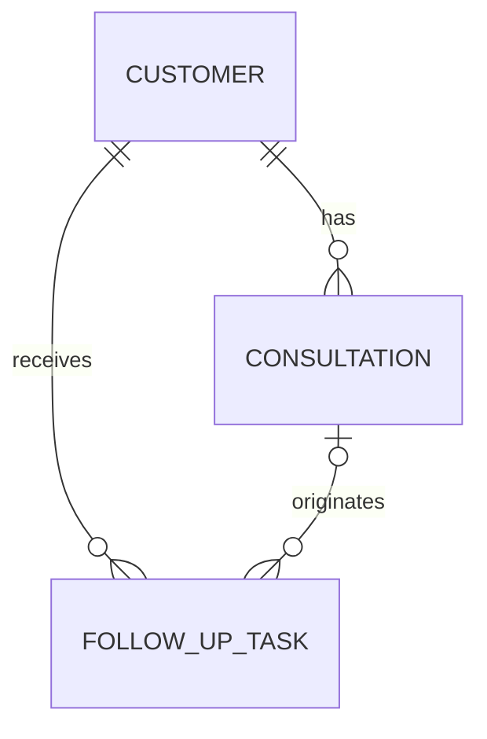

# FollowUp Agent 도메인 모델 및 PostgreSQL 스키마 설계

## 1. 문서 목적

이 문서는 AGENT-12 `도메인 모델 및 PostgreSQL 스키마 설계`의 설계 기준을 기록한다.

FollowUp Agent MVP가 고객 정보, 상담 이력, 후속 업무를 일관된 관계로 저장하고
이후 Read Tool과 Write Tool이 같은 도메인 의미를 사용하도록 하는 것이 목적이다.

이번 단계에서는 논리 모델과 PostgreSQL 스키마를 설계한다.
실제 Migration, Docker 기반 PostgreSQL, Seed 데이터와 ORM 도입은 다음 작업에서 진행한다.

## 2. 설계 범위와 원칙

- 실제 개인정보가 아닌 가상의 테스트 데이터만 사용한다.
- 데이터베이스 내부 식별자와 사용자에게 노출할 업무 식별자를 구분한다.
- 고객 이름은 동명이인이 존재할 수 있으므로 고유값으로 취급하지 않는다.
- 상담 이력과 후속 업무는 고객의 업무 기록이므로 고객과의 참조 무결성을 보장한다.
- 이력 보존을 위해 물리 삭제보다 상태 변경을 우선한다.
- 시간 값은 서버와 사용자의 시간대 차이를 고려해 절대 시점을 저장한다.
- 중복 실행 방지와 Agent 실행 추적에 필요한 확장 지점을 남긴다.

## 3. 도메인 책임

### Customer

고객의 최소 식별 정보와 현재 관리 상태를 나타내는 Aggregate Root다.

책임:

- 고객을 내부 식별자와 업무 식별자로 구분한다.
- 고객의 표시 이름과 활성 상태를 관리한다.
- 해당 고객의 상담 이력과 후속 업무를 조회하는 시작점이 된다.

MVP에서는 전화번호, 이메일, 주소와 같은 실제 개인정보를 저장하지 않는다.

### Consultation

특정 고객과 수행한 상담의 시점과 요약을 나타내는 이력 데이터다.

책임:

- 어떤 고객의 상담인지 연결한다.
- 상담 시점과 상담 요약을 보존한다.
- 고객별 최근 상담 이력을 시간 역순으로 조회할 수 있게 한다.
- 필요한 경우 후속 업무가 생성된 근거 상담이 된다.

이미 수행된 상담은 과거 사실이므로 상태 변경이나 물리 삭제 대상이 아니다.
내용 정정이 필요하면 별도 감사 정책을 도입하기 전까지 애플리케이션에서 제한한다.

### FollowUpTask

고객에게 수행해야 하는 후속 조치와 진행 상태를 나타내는 업무 데이터다.

책임:

- 업무 대상 고객을 연결한다.
- 후속 조치의 제목, 설명, 기한과 상태를 관리한다.
- 특정 상담에서 파생된 경우 근거 상담을 선택적으로 연결한다.
- 완료 상태와 완료 시점의 일관성을 유지한다.
- Write Tool 재시도 시 중복 생성을 방지할 수 있는 키를 수용한다.

## 4. 엔티티 관계

- 고객 한 명은 상담 이력을 0개 이상 가진다.
- 상담 이력 하나는 반드시 고객 한 명에게 속한다.
- 고객 한 명은 후속 업무를 0개 이상 가진다.
- 후속 업무 하나는 반드시 고객 한 명에게 속한다.
- 후속 업무는 특정 상담에서 파생될 수도 있고, 상담과 무관하게 생성될 수도 있다.
- 근거 상담이 연결된 후속 업무는 반드시 해당 업무와 같은 고객의 상담을 참조해야 한다.

## 5. 도메인 상태

### Customer 상태

| 상태 | 의미 | 허용되는 다음 상태 |
|---|---|---|
| `active` | 현재 후속 관리 대상이 될 수 있는 고객 | `inactive` |
| `inactive` | 현재 운영 대상에서 제외된 고객 | `active` |

`inactive`는 고객과 기존 업무 기록을 삭제하지 않고 운영 대상에서만 제외하기 위한 상태다.

### FollowUpTask 상태

| 상태 | 의미 | 허용되는 다음 상태 |
|---|---|---|
| `pending` | 생성됐지만 아직 시작하지 않은 업무 | `in_progress`, `cancelled` |
| `in_progress` | 담당자가 처리 중인 업무 | `completed`, `cancelled` |
| `completed` | 정상적으로 완료된 업무 | 없음 |
| `cancelled` | 더 이상 수행하지 않는 업무 | 없음 |

MVP에서는 종료된 업무를 다시 여는 전이를 지원하지 않는다.
필요해지면 상태 이력 모델과 함께 별도 작업으로 확장한다.

## 6. 핵심 불변 조건

- 모든 엔티티는 변경되지 않는 내부 식별자를 가진다.
- `customer_code`와 `consultation_code`는 각각 업무 식별자로 고유해야 한다.
- 고객 이름은 필수지만 고유하지 않다.
- 상담은 존재하는 고객만 참조할 수 있다.
- 후속 업무는 존재하는 고객만 참조할 수 있다.
- 후속 업무가 근거 상담을 참조하면 상담과 업무의 고객이 같아야 한다.
- `completed` 상태인 후속 업무만 완료 시각을 가진다.
- 제목, 이름, 상담 요약에는 공백만 저장할 수 없다.

## 7. 설계 근거와 후속 작업 경계

- 프로젝트 시나리오와 MVP 범위: [`00-project-brief.md`](./00-project-brief.md)
- Agent Workflow 결정: [`technical-decisions/langgraph.md`](./technical-decisions/langgraph.md)
- 실제 테이블 생성과 테스트 데이터 구성: AGENT-13
- Agent API 계약 정의: AGENT-14
- Read Tool 구현: AGENT-16
- 후속 업무 Write Tool 및 중복 실행 검증: 이후 MVP 작업
