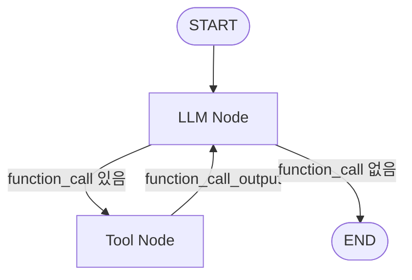

# LangGraph Workflow 기술 검증

## 1. 검증 배경

Task 2에서 LLM이 Tool 호출을 요청하는 동안 반복 실행하는
Tool Execution Loop를 직접 구현했다.

현재 구조만으로도 다단계 Tool 호출은 처리할 수 있지만,
실제 Agent에서는 상태 관리, 조건 분기, 사용자 승인,
실패 처리와 같은 Workflow가 추가될 수 있다.

동일한 업무 흐름을 LangGraph로 구성하여
직접 구현한 실행 Loop와 비교하고,
실제 Agent Backend에 LangGraph를 도입할 필요가 있는지 검증한다.


## 2. 검증 질문

- 직접 구현한 Tool Execution Loop와 LangGraph의 실행 구조는 어떻게 다른가?
- Agent의 상태를 어떤 방식으로 관리하는가?
- Tool 호출 여부에 따른 조건 분기를 어떻게 표현하는가?
- 여러 Node 사이에서 Tool 실행 결과를 어떻게 전달하는가?
- 사용자 승인과 같은 중간 단계를 추가하기 쉬운가?
- 실패 및 재시도 흐름을 명시적으로 표현할 수 있는가?
- 얻는 이점이 추가되는 복잡도보다 큰가?


## 3. 비교 기준

| 항목 | 직접 구현 Loop | LangGraph |
|---|---|---|
| 다단계 Tool 실행 | 검증 완료 | 검증 완료 |
| 단일 Tool 실행 | 검증 완료 | 검증 완료 |
| 상태 관리 | 응답 객체와 지역 변수로 관리 | 공통 State로 검증 완료 |
| 조건 분기 | `while` 내부 조건문 | Conditional Edge로 검증 완료 |
| 사용자 승인 단계 | 검증 예정 | 검증 예정 |
| 실패 흐름 표현 | 검증 예정 | 검증 예정 |
| 코드 복잡도 | 검증 예정 | 검증 예정 |


## 4. 관찰 결과

### 조건 분기 및 State 전달

- 공통 State를 통해 Node 간 중간 결과를 전달할 수 있음을 확인했다.
- `decide_request` 결과에 따라 서로 다른 실행 경로로 분기할 수 있었다.
- `trace`를 통해 실제 실행된 Node 순서를 확인할 수 있었다.
- 현재 분기 판단은 `"고객"` 키워드를 사용하는 임시 규칙이며,
  실제 LLM의 Tool 선택을 검증한 것은 아니다.
- `lookup_customer` 역시 외부 시스템 호출이 아닌 테스트 데이터 반환 함수다.

### 실제 LLM Tool Calling Flow

단일 Tool인 `get_customer(name)`를 OpenAI Responses API에 등록하고,
직접 구현 Loop에서 사용했던 Tool Calling 방식을 LangGraph의 Node와 Edge로 재현했다.

고객 조회 요청 `김민수 고객 정보를 알려줘.`의 실행 경로는 다음과 같았다.

```text
START
→ call_llm:function_call:get_customer
→ execute_tool:get_customer(김민수)
→ call_llm:final_answer
→ END
```

- 첫 번째 LLM Node가 `get_customer` Function Call을 반환했다.
- Tool Node가 가짜 고객 데이터를 실행하고 `function_call_output`을 만들었다.
- 두 번째 LLM Node가 Tool 결과를 받아 최종 답변을 생성했다.

인사 요청 `안녕하세요.`에서는 Function Call이 없었고 다음 경로로 종료됐다.

```text
START
→ call_llm:final_answer
→ END
```

이를 통해 Tool 호출 여부가 키워드 규칙이 아니라 실제 LLM의 Function Calling 결과에 따라 분기되는 것을 확인했다.

### Node 사이에서 전달한 State

- `userMessage`: 최초 사용자 요청
- `previousResponseId`: Tool 결과를 전달할 다음 Responses API 호출의 연결 정보
- `pendingToolCall`: LLM이 요청한 Tool 이름, 인자, 호출 ID
- `toolOutput`: 앱이 실행한 Tool 결과를 직렬화한 값
- `finalAnswer`: Tool 호출이 끝난 뒤 LLM이 생성한 답변
- `trace`: 실제 통과한 Node 순서

직접 구현 Loop에서도 동일한 API 호출과 Tool 실행을 수행한다. 차이는 반복문의 조건문이 다음 단계를 결정하는 대신, LangGraph에서는 `pendingToolCall`을 보고 Conditional Edge가 Tool Node 또는 종료를 선택한다는 점이다.

### 의존 관계가 있는 다단계 Tool Calling

고객 정보와 최근 상담 이력을 함께 요청하는 시나리오를 실행했다.
`get_consultations`는 고객 이름이 아닌 `customer_id`를 입력으로 받으므로,
첫 번째 Tool 결과가 두 번째 Tool 호출에 필요하다.

```text
START
→ call_llm:function_call:get_customer
→ execute_tool:get_customer({"name":"김민수"})
→ call_llm:function_call:get_consultations
→ execute_tool:get_consultations({"customer_id":"C001"})
→ call_llm:final_answer
→ END
```

- 첫 번째 LLM Node가 `get_customer(name="김민수")`를 선택했다.
- 고객 조회 결과의 `C001`을 받은 뒤, LLM이 `get_consultations(customer_id="C001")`를 선택했다.
- Backend와 Graph에는 `get_customer → get_consultations`의 개별 호출 순서를 정의하지 않았다.
- Graph는 `LLM → Tool → LLM`이라는 일반적인 반복 구조만 관리한다.
- `trace`에 Tool 이름과 실제 arguments를 남겨, 다단계 호출 순서와 데이터 의존성을 확인했다.

### MVP Workflow Diagram



## 5. 검증 범위와 남은 확인 사항

- 단일 Tool `get_customer`와, 결과 의존성이 있는 `get_customer → get_consultations` 순차 호출을 검증했다.
- 고객 정보는 테스트 데이터이며 DB, 외부 API, 사용자 승인, 재시도, checkpoint는 연결하지 않았다.
- 단일 Tool 흐름에서는 직접 구현 Loop보다 LangGraph 코드와 State 항목이 더 늘어난다.
- 따라서 이번 결과만으로 복잡한 업무 Workflow에서의 유지보수성 우위를 결론낼 수는 없다.


## 6. 기술적 결정

### 결정: MVP Agent Workflow에 LangGraph를 채택

단일 Tool Calling은 기존의 직접 구현 Loop로도 충분히 처리할 수 있다.
LangGraph는 실행 경로를 Node와 Edge로 명시하고 State 변화를 추적하기 쉽게 만들지만,
단순한 흐름만 다루면 추가되는 State 설계와 라이브러리 의존성이 더 클 수 있다.

그러나 이 프로젝트의 MVP는 여러 Tool을 LLM 판단으로 순차 실행하고,
이전 Tool 결과를 다음 Tool 입력으로 전달하는 Agent Workflow를 다룬다.
따라서 실행 경로, 중간 State, Tool 호출 trace를 명시적으로 관리하기 위해
LangGraph를 MVP의 Agent Workflow Orchestration Layer로 채택한다.

이는 LangGraph가 직접 구현 Loop보다 항상 우수하다는 결론이 아니다.
직접 Loop는 단순 Tool Calling의 기준 구현으로 유지하며,
MVP에서는 Workflow를 확장하고 설명하기 위한 구조적 선택으로 LangGraph를 사용한다.

MVP 이후 아래 요구가 추가될 때 State와 Edge를 확장한다.

- 사용자 승인 또는 중단 후 재개가 필요한 경우
- Tool 실패에 따라 재시도, 대체 경로, 종료를 명시적으로 분기해야 하는 경우
- 실행 경로와 중간 State를 운영 환경에서 추적해야 하는 경우

### MVP 구현에서의 적용 시점

이 문서의 Spike는 LangGraph 채택 여부를 판단하기 위한 기술 검증이다.
실제 NestJS Agent Backend와 PostgreSQL 기반 Read Tool에 LangGraph를 연결하는 작업은
MVP 구현 순서의 7단계에서 수행한다.

그 전 단계에서는 NestJS 환경, 도메인·스키마, Migration·Seed, API 계약,
Tool 인터페이스와 Read Tool을 먼저 준비한다.


## 7. MVP 구현 결과 (AGENT-17)

### 적용 구조

Spike에서 검증한 반복 구조를 NestJS Backend의 실제 Read Tool과 연결했다.

```text
POST /agent/runs
→ AgentService: executionId 생성
→ AgentWorkflowService: LangGraph 실행
→ LLM Node: OpenAI Responses API 호출
→ Conditional Edge: pendingToolCall 유무 확인
   ├─ 있음: Tool Node → ToolRegistry → PostgreSQL Read Tool → LLM Node
   └─ 없음: END
→ answer와 trace 반환
```

Graph는 `get_customer`, `get_consultations`의 개별 실행 순서를 알지 못한다.
LLM Node가 반환한 Function Call이 있으면 Tool Node로 이동하고,
Tool Node는 Registry에서 같은 이름의 Tool을 찾아 실행한다.
실행 결과를 받은 뒤에는 어떤 Tool이 실행됐는지와 관계없이 LLM Node로 돌아간다.

### State

| 값 | 역할 |
|---|---|
| `executionId` | 한 번의 Agent 실행과 Tool 실행을 연결하는 식별자 |
| `userMessage` | 최초 사용자 요청 |
| `previousResponseId` | OpenAI Responses API의 이전 응답과 후속 호출 연결 |
| `pendingToolCall` | 실행 대기 중인 Tool 이름, 인자, `callId` |
| `toolOutput` | Tool 실행 결과와 원래 Function Call을 연결하는 값 |
| `finalAnswer` | Function Call이 끝난 뒤 모델이 만든 최종 답변 |
| `trace` | Node 및 Tool 이름, Tool arguments의 실제 실행 순서 |

### 검증 전략

외부 API 상태와 모델의 비결정성 때문에 일반 단위 테스트는 Scripted LLM을 사용한다.
이 테스트는 Graph의 세 가지 경로와 State 전달을 결정적으로 검증한다.

- Tool 미사용: `llm → END`
- 단일 Tool: `llm → get_customer → llm → END`
- 다단계 Tool: `llm → get_customer → llm → get_consultations → llm → END`

실제 모델의 Tool 선택은 일반 테스트와 분리한 `pnpm agent:verify`로 확인한다.
2026-08-20에 OpenAI Responses API와 PostgreSQL Seed 데이터를 연결해 실행한 결과는 다음과 같다.

```text
안녕하세요.
→ llm

김민수 고객 정보를 알려줘.
→ llm
→ get_customer({"name":"김민수"})
→ llm

김민수 고객의 기본 정보와 최근 상담 내용을 같이 알려줘.
→ llm
→ get_customer({"name":"김민수"})
→ llm
→ get_consultations({"customer_id":"C001"})
→ llm
```

다단계 경로에서 첫 Tool이 PostgreSQL에서 반환한 `C001`이
두 번째 Tool의 `customer_id` arguments로 사용됐고,
최종 답변에는 고객 기본 정보와 최근 상담 내용이 함께 포함됐다.

### 직접 구현 Loop와의 대응 관계

| 직접 구현 Loop | LangGraph MVP |
|---|---|
| `while (functionCall)` | `Tool Node → LLM Node` 순환 Edge |
| Function Call 유무를 `if`로 확인 | Conditional Edge가 `pendingToolCall` 확인 |
| 지역 변수에 이전 응답과 Tool 결과 저장 | 명시적인 State에 저장 |
| 반복문 안에서 Tool 실행 | Tool Node가 Registry를 통해 실행 |

단순 Tool Calling만 보면 LangGraph가 State, Node, Edge 코드를 추가하므로 더 복잡하다.
MVP에서는 이후 Write Tool, 사용자 승인, 실패 분기처럼 실행 경로가 늘어날 계획이므로,
현재의 추가 복잡도를 수용하고 Workflow 경계를 명시적으로 유지한다.

### 현재 경계

- `parallel_tool_calls`는 비활성화해 한 번에 하나의 Tool Call만 처리한다.
- 최대 Graph 실행 단계는 20으로 제한한다.
- Tool 실패 retry, timeout, 오류 응답 매핑은 아직 구현하지 않았다.
- AGENT-19에서 checkpoint, 사용자 승인과 중단 후 재개를 구현했다.
- Write Tool은 Registry에 등록됐지만 `effect: write` 정책을 통과해야 실행된다.

## 8. 사용자 승인 Workflow 구현 결과 (AGENT-19)

### 선택한 구조

```text
LLM Function Call
→ Tool effect 확인
   ├─ read  → Tool 실행
   └─ write
      ├─ required → 승인 요청 State 저장 → interrupt
      │              ├─ approve → Tool 실행 → LLM
      │              └─ reject  → DB 변경 없이 END
      └─ auto     → 자동 승인 trace → Tool 실행 → LLM
```

`executionId`를 LangGraph의 `thread_id`로 사용한다.
따라서 최초 HTTP 요청이 끝난 뒤에도 같은 실행 ID로 checkpoint를 찾아
`Command({ resume: decision })`으로 중단된 Node를 재개할 수 있다.

### State 추가 값

| 값 | 역할 |
|---|---|
| `writeApprovalMode` | Backend가 최종 적용한 `required \| auto` 정책 |
| `approval.id` | 사용자가 확인한 승인 대상을 구분하는 서버 생성 UUID |
| `approval.status` | `none \| pending \| approved \| rejected` 상태 |
| `approval.toolName` | 승인 대상 Write Tool 이름 |
| `approval.arguments` | 사용자에게 보여줄 실행 예정 인자 |

승인 결과는 `approval` trace로 기록하고,
실제 Tool 실행은 기존 `tool` trace로 별도 기록한다.
따라서 “승인했다”와 “DB 변경 Tool이 실행됐다”를 구분할 수 있다.

### 안전장치

- 기본값은 `required`다.
- 요청자가 `auto`를 선택해도 서버의 `AGENT_ALLOW_AUTO_WRITE`가 허용해야 한다.
- 승인 전에는 `execute_tool` Node로 이동하지 않는다.
- 승인 재개는 기존 `executionId`의 pending 상태와 요청의 `approvalId`가 일치할 때만 허용한다.
- 같은 승인 ID와 결정의 중복 요청은 완료 응답 또는 같은 진행 중 작업을 공유해 재실행하지 않는다.
- 다음 Write가 제안되면 새 승인 ID를 생성한다. 이전 승인 재전송은 409로 거부하므로 다음 Write를 승인하지 않는다.
- Write Tool의 DB 멱등성 키가 동시·재시도 상황의 최종 중복 생성을 방지한다.

### 검증 결과

- 승인 전 PostgreSQL 생성 0건
- 승인 후 생성 1건
- 같은 승인 재전송 후에도 1건
- 거절 시 생성 0건
- `auto` 허용 경로는 interrupt 없이 생성 1건
- Read Tool과 Tool 미사용 경로는 기존 동작 유지

### 현재 한계

MVP checkpointer는 프로세스 메모리의 `MemorySaver`다.
그래서 현재 구현은 단일 프로세스에서 승인 중단·재개 구조를 검증한 결과이며,
서버 재시작 복구나 여러 인스턴스 간 재개를 보장하지 않는다.
운영 단계에서는 PostgreSQL 또는 Redis 기반 영속 checkpointer와
사용자별 승인 권한, 감사 로그를 추가해야 한다.

## 9. 핵심 시나리오 E2E 결과 (AGENT-20)

AGENT-17~19의 기능을 개별 테스트로만 확인하지 않고
HTTP API에서 실제 PostgreSQL까지 연결해 최종 검증했다.

```text
AgentController
→ AgentService
→ LangGraph
→ Tool Registry
→ PostgreSQL
```

OpenAI 호출은 결과가 결정적인 Scripted LLM으로 대체했다.
Scripted LLM은 `get_customer` 결과에 `C001`이 있어야
`get_consultations(customer_id="C001")`을 반환하고,
상담 결과에 `CONS001`이 있어야 Write 호출 또는 최종 답변으로 진행한다.

확인한 결과는 다음과 같다.

- Tool 미사용 요청은 `llm → END`로 종료되고 DB를 변경하지 않았다.
- 다단계 Read는 `get_customer → get_consultations` 순서와 arguments가 Trace에 남았다.
- Write는 승인 전 0건, 승인 후 `C001/CONS001`에 연결된 1건이 생성됐다.
- 거절 시 Write Tool Trace가 없었고 DB도 변경되지 않았다.
- 미존재 고객 C999는 승인 후에도 `not_found`로 종료되고 DB 0건을 유지했다.
- 같은 실행을 다시 승인해도 첫 응답과 DB 1건을 유지했다.
- 모든 테스트 종료 후 시나리오용 임시 업무는 0건이었다.

이 결과는 Backend orchestration과 데이터 일관성의 E2E 증거다.
실제 모델의 비결정적 Tool 선택 품질은 별도 `pnpm agent:verify` 범위이며,
자세한 시나리오와 실행 방법은 `docs/e2e-scenarios.md`에 기록한다.
