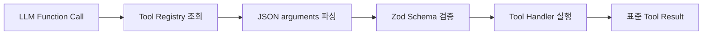

# Tool 인터페이스 및 실행 구조

## 1. 목적

AGENT-15에서는 LLM이 선택한 Tool을 Backend가 안전하고 일관된 방식으로 실행할 공통 구조를 정의한다.

개별 Tool 호출 순서를 Backend 코드에 넣지 않고,
Tool 이름과 arguments를 Registry에 전달하면 같은 검증·실행 규칙이 적용되게 하는 것이 목적이다.

## 2. 실행 흐름



1. Registry가 Function Call의 `name`으로 등록된 Tool을 찾는다.
2. OpenAI가 문자열로 반환한 `arguments`를 JSON으로 파싱한다.
3. Tool별 Zod Schema로 실제 Handler 입력을 검증한다.
4. 검증된 값만 Handler에 전달한다.
5. Handler 결과를 `success` 또는 `not_found`로 반환한다.
6. 실행 실패는 결과 데이터와 섞지 않고 `ToolExecutionError`로 전달한다.

## 3. Tool 정의 계약

모든 Tool은 `defineAgentTool()`로 다음 세 요소를 함께 정의한다.

| 요소 | 소비자 | 역할 |
|---|---|---|
| `definition` | LLM | 이름, 설명, JSON Schema와 strict 설정 |
| `inputSchema` | Backend | 실제 실행 직전 arguments 런타임 검증 |
| `handler` | Backend | 검증된 입력으로 업무 기능 실행 |

```typescript
const exampleTool = defineAgentTool({
  definition: {
    type: 'function',
    name: 'example_tool',
    description: '예시 Tool입니다.',
    parameters: {
      type: 'object',
      properties: {
        value: { type: 'string' },
      },
      required: ['value'],
      additionalProperties: false,
    },
    strict: true,
  },
  inputSchema: z.object({
    value: z.string().trim().min(1),
  }),
  handler: async ({ value }, context) => {
    return toolSuccess({ value, executionId: context.executionId });
  },
});
```

JSON Schema는 LLM이 올바른 Function Call을 만들도록 안내하고,
Zod Schema는 LLM 출력이 실제 Handler에 들어가기 전에 Backend 경계에서 검증한다.
LLM이 strict schema를 사용하더라도 Backend 검증은 생략하지 않는다.

## 4. 실행 결과와 오류 구분

### 정상 결과

```json
{
  "status": "success",
  "data": {
    "id": "C001"
  }
}
```

### 데이터 미존재

```json
{
  "status": "not_found",
  "data": null,
  "message": "고객을 찾을 수 없습니다."
}
```

데이터 미존재는 Tool 실행 실패가 아니다.
LLM이 사용자의 요청에 맞는 안내를 생성할 수 있도록 정상적인 Tool 결과로 전달한다.

### 실행 오류

| 오류 코드 | 발생 시점 |
|---|---|
| `TOOL_NOT_SUPPORTED` | Registry에 등록되지 않은 Tool 이름 |
| `TOOL_ARGUMENTS_INVALID` | JSON 파싱 또는 Zod 입력 검증 실패 |
| `TOOL_EXECUTION_FAILED` | 검증 이후 Handler 실행 실패 |

오류 응답에는 원본 arguments 값, DB 연결 정보와 내부 Stack을 노출하지 않는다.

## 5. 호출 순서를 하드코딩하지 않는 구조

Registry는 다음 질문만 처리한다.

```text
요청받은 이름의 Tool이 있는가?
→ arguments가 유효한가?
→ 해당 Handler의 결과는 무엇인가?
```

Registry와 Handler에는 아래와 같은 업무 순서가 없다.

```text
get_customer 다음에는 get_consultations를 호출한다
```

어떤 Tool을 언제 호출할지는 AGENT-17의 LLM Node가 결정한다.
Tool Node는 LLM이 선택한 이름을 Registry에 전달할 뿐이다.
따라서 새 Tool을 추가해도 Graph의 개별 호출 순서를 수정하지 않는다.

## 6. 테스트 전략

### 공통 실행 구조 단위 테스트

- 등록된 정의가 LLM에 전달할 형식으로 반환되는지 확인
- JSON arguments가 파싱되고 검증된 값만 Handler에 전달되는지 확인
- 검증 실패 시 Handler가 호출되지 않는지 확인
- `not_found`가 실행 오류와 구분되는지 확인
- 미지원 Tool 이름을 거부하는지 확인
- 중복 Tool 이름 등록을 거부하는지 확인

### 개별 Tool 단위 테스트

- Tool별 Zod Schema 경계값
- Repository 정상 결과를 `success`로 변환
- Repository 미존재 결과를 `not_found`로 변환
- Handler가 검증된 값만 Repository에 전달하는지 확인

### 통합 테스트

- 실제 PostgreSQL Seed 데이터를 Repository가 조회하는지 확인
- Registry를 통해 실제 Tool Handler와 데이터베이스가 연결되는지 확인

AGENT-16에서 `get_customer`, `get_consultations`에 이 전략을 적용한다.

## 7. 코드 위치

- Tool 정의 계약: `apps/api/src/tools/contracts/tool-definition.ts`
- Tool 결과 계약: `apps/api/src/tools/contracts/tool-result.ts`
- Tool 생성 함수: `apps/api/src/tools/define-agent-tool.ts`
- Registry: `apps/api/src/tools/tool-registry.ts`
- 오류 계약: `apps/api/src/tools/tool-execution.error.ts`
- 단위 테스트: `apps/api/src/tools/tool-registry.spec.ts`
